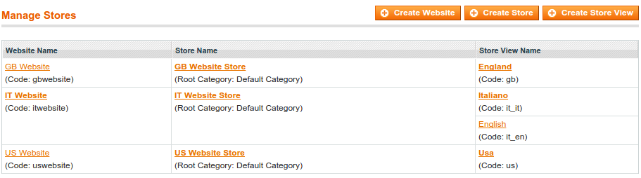
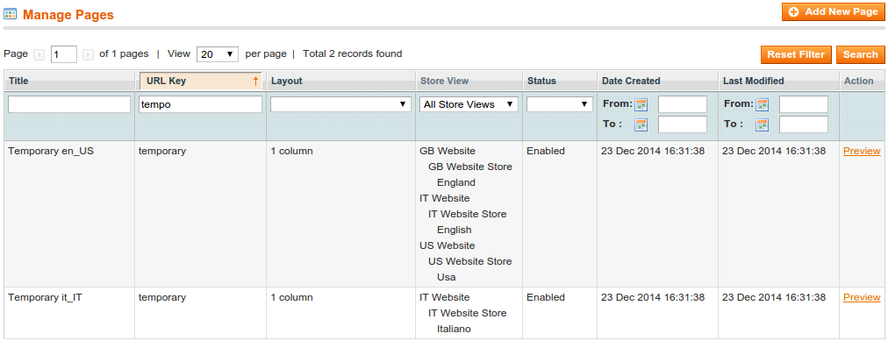

Webgriffe Cms By Locale
=======================

Magento extension that generates static content for each store views grouped by locale.

Installation
------------

Please, use [Magento Composer Installer](https://github.com/magento-hackathon/magento-composer-installer) and add `webgriffe/cms-by-locale-extension` to your dependencies. Also add this repository to your `composer.json`.

	"repositories": [
        {
            "type": "vcs",
            "url": "git@github.com:webgriffe/cms-by-locale-extension.git"
        }
    ]
    
Usage
-----

You may extend your Setup class from `Webgriffe_Cms_Model_Entity_Setup` or some config lines in your extension `config.xml`.

In the first scenario, create a class like

`class Ernani_Cms_Model_Entity_Setup extends Webgriffe_Cms_Model_Entity_Setup
{ }`

In the second, add the following lines in `config.xml`:

    <config>
        <global>
            <resources>
                <YOUR_MODULE_ALIAS_setup>
                    <setup>
                        <module>YOUR_MODULE_NAME</module>
                        <class>Webgriffe_Cms_Model_Entity_Setup</class>
                    </setup>
                </YOUR_MODULE_ALIAS_setup>
            </resources>
        </global>
    </config>

Then, in your data scripts, you may call the methods:
* `$this->generateCmsPage($urlKey, $content)`
* `$this->generateStaticBlock($identifier, $content)`

Example
-------

Magento Stores:

Note: the store view with code `it_it` has locale `it_IT`, all others are `en_US`

data-install-1.0.0.php:

    <?php
    /* @var $installer Webgriffe_Cms_Model_Entity_Setup */
    $installer = $this;

    $installer->startSetup();

    $installer->generateCmsPage('temporary', 'Temporary content');

    $installer->endSetup();

Cms pages created:
